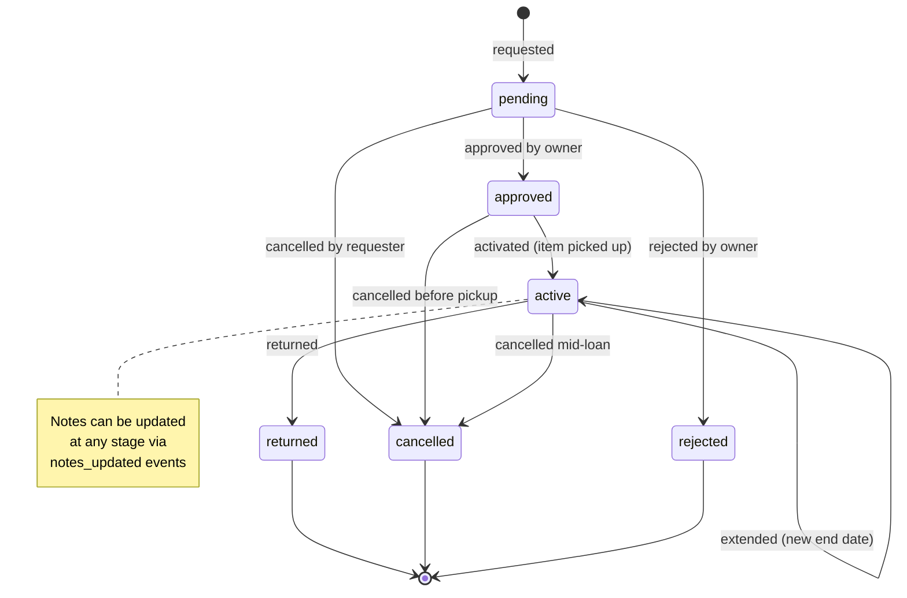

# README

## Event-Sourced Item Reservation System

The reservation system uses event sourcing where the current state of each reservation is computed from an immutable log of events. This provides complete audit trails and enables complex business logic.

## Reservation State Flow

## Event Types

| Event Type | Description | Valid From States | Resulting State |
|------------|-------------|-------------------|------------------|
| `requested` | Initial reservation request | - | `pending` |
| `approved` | Owner approves reservation | `pending` | `approved` |
| `rejected` | Owner rejects reservation | `pending` | `rejected` |
| `activated` | Item picked up by requester | `approved` | `active` |
| `returned` | Item returned by requester | `active` | `returned` |
| `cancelled` | Reservation cancelled | `pending`, `approved`, `active` | `cancelled` |
| `extended` | End date extended | `active` | `active` |
| `notes_updated` | Notes added/modified | Any non-terminal | No state change |

## Outstanding Business Rules

| Category      | Issue                                           | Recommendation                                   |
|---------------|-------------------------------------------------|--------------------------------------------------|
| Logic         | No validation of overlapping reservations       | Add availability check logic on reservation POST |
| Risk Handling | No damage report or dispute workflow            | Add `ReservationReport` or `ItemConditionReport` |

### Implementation Notes

**Logic - Overlapping Reservations:**

* CreateReservation should validate non-overlapping reservations by checking `start` and `end` dates against existing active reservations for the same item
* Consider how to handle floating reservations without specific start/end dates
* Validation should ensure `quantity_requested` doesn't exceed `quantity_available`

**Risk Handling:**

* Not a priority for MVP
* Could be implemented as additional event types (`damage_reported`, `dispute_opened`, etc.) in the future
