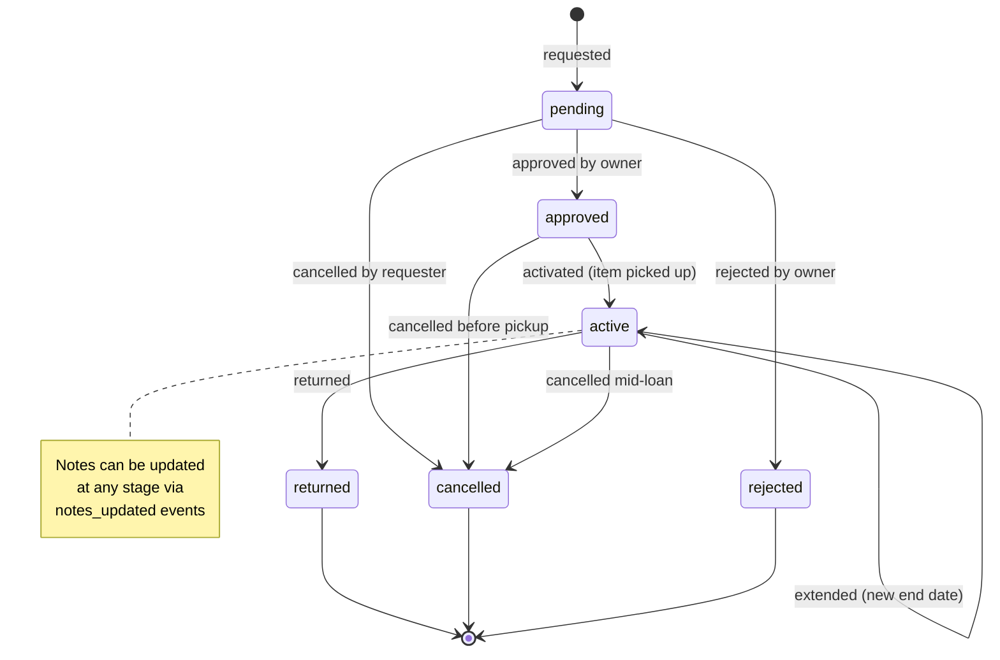

# Toolshed - System Architecture

This document describes the technical architecture and design decisions for the Toolshed neighborhood tool sharing platform.

## Overview

Toolshed is an event-sourced reservation system built with modern web technologies. It enables neighbors to share tools through a controlled borrowing workflow with complete audit trails.

## Technology Stack

### Frontend

- **Framework**: Remix.js with React
- **Styling**: Tailwind CSS with custom neighborhood-themed design system
- **TypeScript**: Full type safety across the application

### Backend

- **Runtime**: Node.js 20
- **Framework**: Remix.js (full-stack)
- **Database**: PostgreSQL 16
- **ORM**: Drizzle ORM with type-safe queries
- **Authentication**: Session-based with express-session

### Infrastructure

- **Development**: Replit with Nix modules
- **Self-hosting**: Docker Compose
- **Database Hosting**: Neon serverless (Replit) / Local PostgreSQL (Docker)

## Architectural Patterns

### Event Sourcing for Reservations

The reservation system uses **event sourcing** where the current state of each reservation is computed from an immutable log of events. This provides:

- **Complete audit trails** of all reservation changes
- **Temporal queries** to see state at any point in time
- **Complex business logic** implementation through event processing
- **Data integrity** through append-only event storage

### Database Schema

```sql
-- Core entities
users (id, name, email, password, neighborhood, contact_method)
items (id, owner_id, title, description, category, location, quantity)

-- Event sourcing
reservation_events (
  id, reservation_id, event_type, actor_id, 
  timestamp, quantity, start_date, end_date, notes
)

-- Session management
sessions (sid, sess, expire)
```

## Reservation State Flow



## Event Types

| Event Type | Description | Valid From States | Resulting State |
|------------|-------------|-------------------|------------------|
| `requested` | Initial reservation request | - | `pending` |
| `approved` | Owner approves reservation | `pending` | `approved` |
| `rejected` | Owner rejects reservation | `pending` | `rejected` |
| `activated` | Item picked up by requester | `approved` | `active` |
| `returned` | Item returned by requester | `active` | `returned` |
| `cancelled` | Reservation cancelled | `pending`, `approved`, `active` | `cancelled` |
| `extended` | End date extended | `active` | `active` |
| `notes_updated` | Notes added/modified | Any non-terminal | No state change |

## Code Organization

### Project Structure

```
toolshed/
├── app/                    # Remix application
│   ├── routes/            # API and page routes
│   ├── utils/             # Shared utilities
│   └── root.tsx           # App shell
├── server/                # Server-side utilities
│   ├── db.ts              # Database connection
│   ├── storage.ts         # Data access layer
│   └── replitAuth.ts      # Authentication setup
├── shared/                # Shared types and schema
│   └── schema.ts          # Drizzle schema definitions
├── docs/                  # Documentation
└── docker/                # Self-hosting setup
```

### Design Patterns

#### Repository Pattern

The `DatabaseStorage` class implements the `IStorage` interface, providing:

- Abstraction over database operations
- Testable data access layer
- Clear separation of concerns

#### Event Sourcing Implementation

```typescript
// Events are stored immutably
const event: ReservationEvent = {
  id: uuid(),
  reservationId: reservation.id,
  eventType: 'approved',
  actorId: owner.id,
  timestamp: new Date()
};

// State is computed from event history
function computeReservationState(events: ReservationEvent[]): ReservationState {
  return events.reduce(applyEvent, initialState);
}
```

#### Type Safety

- Drizzle ORM provides compile-time type checking
- Shared type definitions across client/server
- Inference of types from database schema

## Data Flow

### Reservation Creation Flow

```
User Request → API Route → Validation → Event Creation → Database Storage → State Computation → Response
```

### State Computation

```
Database Query → Event History → Event Processing → Current State → UI Update
```

## Authentication Architecture

### Session Management

- Express-session with PostgreSQL store
- Session data persisted in database
- Configurable session expiration (default: 1 week)

### Security Considerations

- Password hashing with bcrypt
- HTTP-only session cookies
- CSRF protection (to be implemented)
- Input validation (to be implemented)

## API Design

### RESTful Endpoints

```
GET    /api/items              # List items
POST   /api/items              # Create item
GET    /api/items/:id          # Get item details
PUT    /api/items/:id          # Update item
DELETE /api/items/:id          # Delete item

GET    /api/reservations       # List reservations
POST   /api/reservations       # Create reservation
GET    /api/reservations/:id   # Get reservation details
POST   /api/reservations/:id/events  # Add event to reservation

POST   /api/auth/login         # User login
POST   /api/auth/logout        # User logout
GET    /api/health             # Health check
```

### Event Sourcing API

Reservation changes are made through events:

```typescript
POST /api/reservations/:id/events
{
  "event_type": "approved",
  "notes": "Available next week"
}
```

## Deployment Architecture

### Replit Environment

```
Replit Instance
├── Remix Application (Node.js)
├── Neon Database (Serverless PostgreSQL)
└── Static Assets (Public folder)
```

### Docker Self-Hosting

```
Docker Compose
├── App Container (Node.js + Remix)
├── PostgreSQL Container
└── Shared Network + Persistent Volumes
```

### Production Considerations

```
Reverse Proxy (nginx/Caddy)
├── HTTPS Termination
├── Static Asset Serving
└── Application Proxy (Docker/VPS)
    ├── Toolshed App
    ├── PostgreSQL Database
    └── Persistent Storage
```

## Outstanding Technical Debt

### Critical Issues

- **Overlapping Reservations**: No validation prevents double-booking
- **Authentication Security**: Inconsistent password hashing implementation
- **Testing Infrastructure**: No test framework implemented
- **Item Tracking**: Missing item_id in reservation events

### Business Logic Gaps

- **Availability Checking**: Quantity management not enforced
- **Damage Reporting**: No workflow for damaged items
- **Dispute Resolution**: No conflict resolution mechanism

### Implementation Notes

**Overlapping Reservations Logic:**

- CreateReservation should validate non-overlapping reservations by checking `start` and `end` dates against existing active reservations for the same item
- Consider how to handle floating reservations without specific start/end dates
- Validation should ensure `quantity_requested` doesn't exceed `quantity_available`

**Risk Handling:**

- Not a priority for MVP
- Could be implemented as additional event types (`damage_reported`, `dispute_opened`, etc.) in the future

## Performance Considerations

### Database Optimization

- Indexes on frequently queried fields (reservation_id, actor_id, timestamp)
- Event table partitioning for large-scale deployments
- Connection pooling with Drizzle/Neon

### Frontend Optimization

- Server-side rendering with Remix
- Progressive enhancement
- Optimistic UI updates for reservations

## Security Architecture

### Current Implementation

- Session-based authentication
- Password hashing (needs consistency fixes)
- Environment variable configuration

### Recommended Additions

- Input validation middleware
- Rate limiting on API endpoints
- CSRF protection
- Content Security Policy headers
- Audit logging for sensitive operations

## Monitoring and Observability

### Health Checks

- Application health endpoint (`/api/health`)
- Database connectivity verification
- Docker health checks configured

### Logging Strategy (To Implement)

- Structured logging with timestamps
- Error tracking and alerting
- Audit trails for reservation events
- Performance monitoring

## Scalability Considerations

### Current Limitations

- Single-node deployment
- No caching layer
- Basic session management

### Future Enhancements

- Redis for session storage
- CDN for static assets
- Database read replicas
- Horizontal scaling with load balancer

---

**Architecture Status**: MVP Complete  
**Next Review**: After Critical Issues Resolution  
**Last Updated**: 2025-06-08
